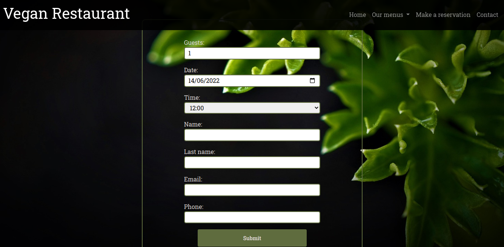
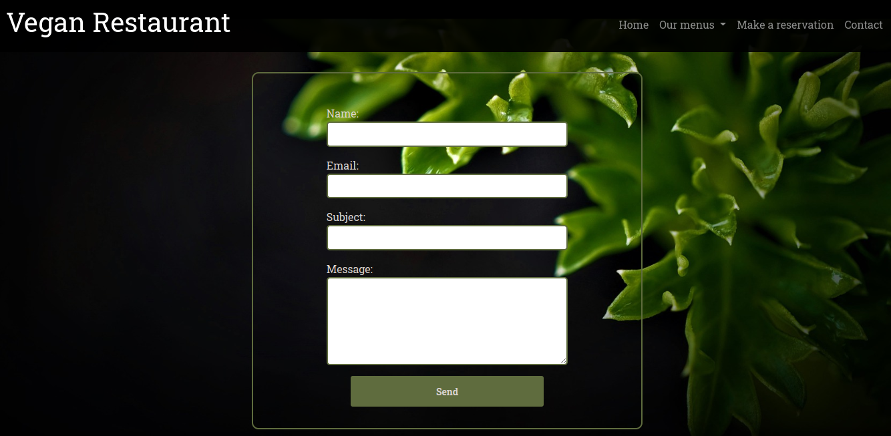
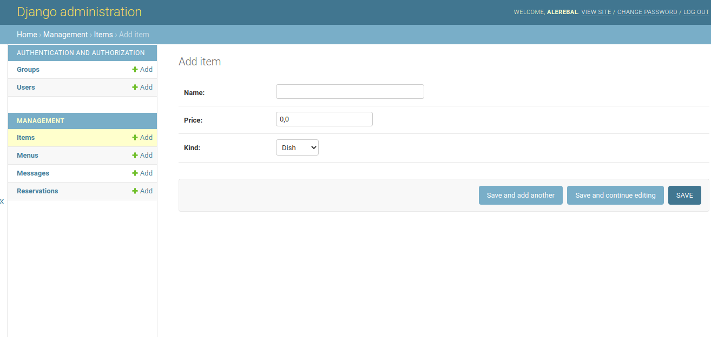
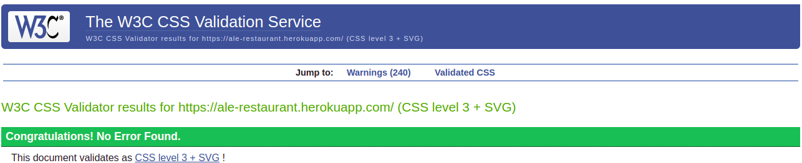
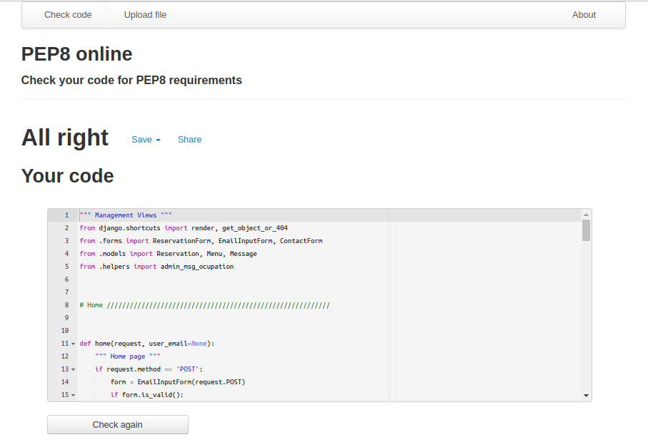
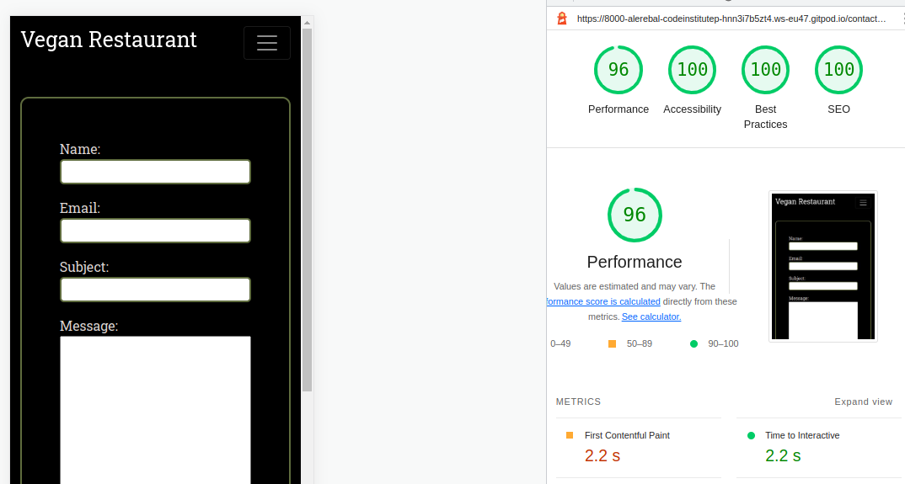
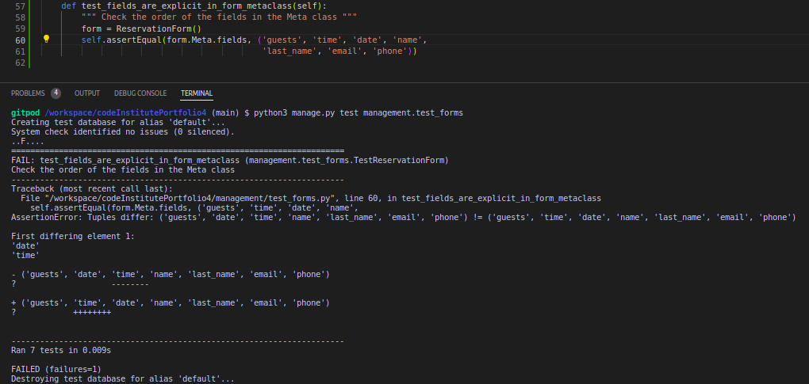

# Vegan Restaurant

Vegan restaurant page using Django for my fourth milestone project at Code Institute. I have used Postgres as database and Cloudinary to stored the images.

Users can make a reservation for a meal from 1 to 10 guests, once it is reserved, modify or cancel it if they want as well. If they already have any reservation, they can access it(or them if more than one) using their email.

A list of different menus are shown in the page(Dishes, desserts and drinks) as well as some forms to make reservation, update or cancel it and to contact with the restaurant.

Admin can create different menus and its items, reservations and manage them in the admin panel. If the restaurant is at 75% capacity at any time, a message will be sent to the administrator.

## Features

### Home page

In the home page there is a welcome message, a form for users to check if they already have any reservation and a link to make a reservation.

### Navigation

The navbar allows to the user navigate between the different pages. There is a drop down menu to go to the different menus, a home link, reservation and contact forms.

### Footer

The footer contains only the social media links.

### Reservations

The reservation form allows the user to enter the number of guests, a day, time, name, lastname, email and telephone to make the reservation.

If the reservation has been done, a messsage is shown to the user

If the user come back to home page clicking the button in the message, in the home page will be shown the reservations that the user already have.

If the user has another reservation at the same day and time, the reservation won't be saved, another message will be displayed and the user have the possibility to go to that reservation.

If the user has another reservation at the same day but at different time, the reservation won't be saved and another message will be displayed for the user accept to take a second reservation at the same day, two is the maximun number of reservations allowed for an user at the same day.

If they accept, the reservation will be saved, if not, they will be sent to the reservation form again.

If the user wants to delete a reservation, an alert will be displayed.

If user delete the reservation a message will be shown.

On the home page there is a form so that the user can check if they already have a reservation.

If they don't have, a message will be shown

Otherwise a list of reservations will be shown.

### Menus

Three menus can be displayed. They are accessible from the navigation bar. The following is one of them.

### Contact

Contact form to users send any message to the restaurant.

### Admin panel

The admin can manage the restaurant from the django admin panel.

Reservations panel with users email and last name filter, in which they can select reservations by day, month or year as well.

Items menu panel, from they can modify or add more items.

Menus panel with the different menus from where they can add more menus or add items to them.

Messages panel in which admin can see all the messages that have been sent, the date of them and if they have been answered.

## Features Left to Implemnt

The admin must be able to answer the users messages from the admin panel.

When the user is trying to get a reservation, the calendar shows all the days of the month, even if they are already pass. It would be nice to make them disabled.

## Testing

### Validator Testing

#### HTML

- No errors were returned when passing through the official [W3C validator](https://validator.w3.org/nu/)

#### CSS

- No errors were found when passing through the official [Jigsaw validator](https://jigsaw.w3.org/css-validator)

    - Gave me some warnings about font-awesome and Bootstrap URI

#### Python

- All the files pass the [PEP8](http://pep8online.com/) test successfully.

- views.py, moderls.py and forms.py as example

#### JS

- No errors were found when passing through the official [JsHint validator](https://jshint.com/)

### Lighthouse Testing

### Django Test

- I have used Django Test to testing the application.

#### Models should return a string

- Check with a wrong string

- Check with a correct string

#### Reservation Form Required Fields

- Check the fields required are filled

#### Reservation form phone not required

- Check phone field is not required

#### Reservation form meta fail

- Change the oreder or the meta class fails

#### Reservation form meta pass

#### Is Room Available

- Check if the function **is_room_available** returns False if there is no room in the restaurant.

#### Duplicated Reservation

- When I used the email that already has a reservation assigned, the funcion **is_duplicated** return True, so the reservation won't be saved

### Coverage Report

Coverage report gave me 76% of the project checked, very low in the views.py file, only 35%.

I did all the automated tests I could and a lot of manual testing (JS file too) to check the rest of the features, the app looks work well at the moment.

## The app has been deployed in Heroku.

Once I finished to set all the variables I had to configure in the settings file(Postgres, Cloudinary and different more variables), create a requirements.txt, set enviroment variables and a Procfile file, the project was ready to deployed.

I created a new app on Heroku and pushed the project to GitHub. But currently it is not possible to connect GitHub to Heroku, so I had to do the deployment from the terminal.

I used the command `heroku login -i` to enter my credentials, then linked the local project to the Heroku app with the command `heroku git:remote -my heroku app-`. After that I just used `git push heroku main` to deploy the app to Heroku.

[Vegan Restaurant is running here.](https://ale-restaurant.herokuapp.com/) 

[This is the admin panel](https://ale-restaurant.herokuapp.com/admin/)

- You can log in with:

        Usersname: CodeInstitute
        Password: CIAdminPanel

## Resourses

### Used libraries

[DJ-Database-URL](https://libraries.io/pypi/dj-database-url)

I used this library to set the app to connect with PostgreSQL

This simple Django utility allows you to utilize the 12factor inspired DATABASE_URL environment variable to configure your Django application.

The dj_database_url.config method returns a Django database connection dictionary, populated with all the data specified in your URL. There is also a conn_max_age argument to easily enable Django's connection pool.

If you'd rather not use an environment variable, you can pass a URL in directly instead to dj_database_url.parse.

[Cloudinary Storage](https://pypi.org/project/dj3-cloudinary-storage/)

I used this library to integrate Cloudinary into the project.

Django Cloudinary Storage is a Django package that facilitates integration with Cloudinary by implementing Django Storage API. With several lines of configuration, you can start using Cloudinary for both media and static files. Also, it provides management commands for removing unnecessary files, so any cleanup will be a breeze. It uses pycloudinary package under the hood.

[Gunicorn](https://pypi.org/project/gunicorn/#:~:text=Gunicorn%20'Green%20Unicorn'%20is%20a,resource%20usage%2C%20and%20fairly%20speedy.)

It is a server that allows run Django on Heroku.

Gunicorn ‘Green Unicorn’ is a Python WSGI HTTP Server for UNIX. It’s a pre-fork worker model ported from Ruby’s Unicorn project. The Gunicorn server is broadly compatible with various web frameworks, simply implemented, light on server resource usage, and fairly speedy.

[Psycopg2](https://pypi.org/project/psycopg2/)

Used to connect the app with PostgreSQL.

Psycopg is the most popular PostgreSQL database adapter for the Python programming language. Its main features are the complete implementation of the Python DB API 2.0 specification and the thread safety (several threads can share the same connection). It was designed for heavily multi-threaded applications that create and destroy lots of cursors and make a large number of concurrent “INSERT”s or “UPDATE”s.

Psycopg 2 is mostly implemented in C as a libpq wrapper, resulting in being both efficient and secure. It features client-side and server-side cursors, asynchronous communication and notifications, “COPY TO/COPY FROM” support. Many Python types are supported out-of-the-box and adapted to matching PostgreSQL data types; adaptation can be extended and customized thanks to a flexible objects adaptation system.

Psycopg 2 is both Unicode and Python 3 friendly.

### Content

#### The background images were taken from 

[Pixabay](https://pixabay.com/) 

#### Some of the menus items were taken from

[Cornucopia](https://cornucopia.ie/)

#### The images of the media buttons were taken from

[Font Awesome](https://fontawesome.com/)

